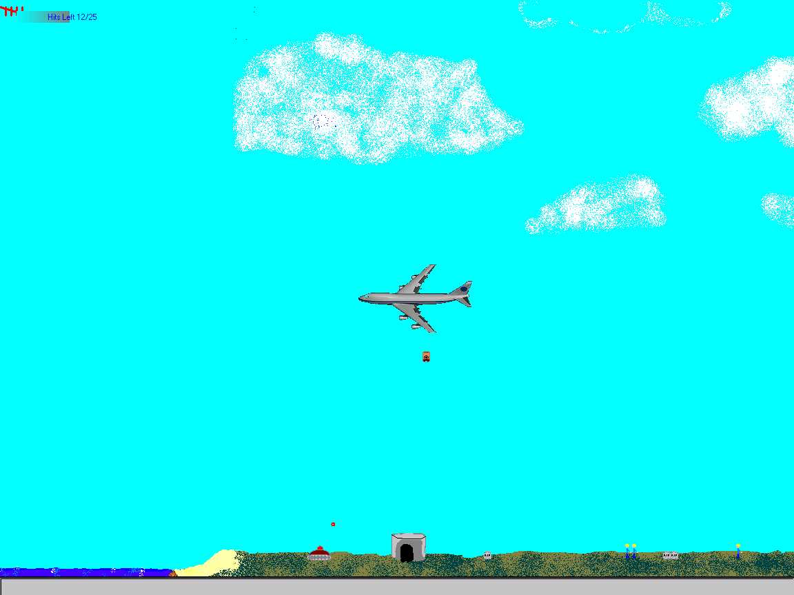



## Plane Game

### Description

This is just little game I made to help pass the time at work. PLEASE download this game and give me feedback. It's not finished but I would like to know which direction to go with it, better graphics, better gameplay, or should I just give up.
 
### More Info
 
Ctrl - Drops bombs

Shift - Shoots gun

Esc - Quits game

(Get down close to the ground, a ladder will descend, you can pick people up with it)

People can die, tanks can't

This is not a final product. It needs MANY improvements. Right now it is at the playable point, but it has much more potential. I'll probably put up newer versions as time goes on if I get good feedback from this one. Hope you enjoy it. (Sorry about the messy coding, I'll clean it up and document on the next version)

If anyone knows a good collsion function, or how I can improve mine, PLEASE tell me.

             |
---                |---
**Submitted On**   |2000-06-23 08:58:34
**By**             |[Chad Bjorklund](https://github.com/Planet-Source-Code/PSCIndex/blob/master/ByAuthor/chad-bjorklund.md)
**Level**          |Beginner
**User Rating**    |5.0 (15 globes from 3 users)
**Compatibility**  |VB 5\.0, VB 6\.0
**Category**       |[Games](https://github.com/Planet-Source-Code/PSCIndex/blob/master/ByCategory/games__1-38.md)
**World**          |[Visual Basic](https://github.com/Planet-Source-Code/PSCIndex/blob/master/ByWorld/visual-basic.md)
**Archive File**   |[CODE\_UPLOAD70226232000\.zip](https://github.com/Planet-Source-Code/chad-bjorklund-plane-game__1-9158/archive/master.zip)

